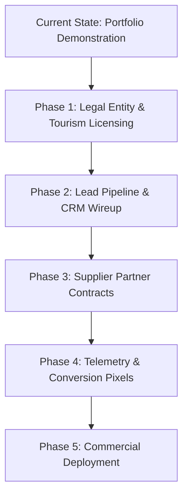

# Commercial & Portfolio Strategy Plan: Taiwan Top Travel

## 1. Executive Summary & Project Purpose

**Taiwan Top Travel** is a bespoke, animation-heavy digital travel concierge showcase built for the 2026 Taiwan luxury circuit. 

* **Primary Mode:** **Design & Technical Portfolio Showcase** (High-Performance Creative Engineering).
* **Secondary Pathway:** **Commercial Viability Transition Plan** (Headless Concierge / Lead Generation Operator).

This document serves as the architectural, commercial, and compliance roadmap for operating the project safely as a flagship portfolio piece while retaining an immediate, turnkey path to commercial monetization.

---

## 2. Portfolio Showcase Architecture & Compliance

### 2.1 Portfolio Positioning
When presenting this work to clients, agencies, or on marketplaces (Upwork, Fiverr, GitHub, personal portfolio):
* **Technical Highlights:** Astro 5/7 SSG, Tailwind CSS v4, Anime.js v4.5 scoped orchestration, interactive GPU-accelerated horizontal runway (`translate3d`), zero-CLS reactive UI.
* **Domain Context:** Demonstrates mastery of high-net-worth (HNW) e-commerce psychology, responsive touch ergonomics, and localized geographic curation.

### 2.2 Marketplace & Legal Compliance (Fiverr / Upwork / Tourism Laws)
* **Zero Direct Contact Leakage:** All direct telephone numbers, WhatsApp indicators, and external email addresses are scrubbed from the codebase to adhere to platform Terms of Service.
* **Demonstration Disclaimers:** Visible legal and concept disclaimers deployed across the Footer, Concierge Wizard, and submission success modal.
* **Regulatory Exemption:** Explicitly clarifies that the site is an interactive demonstration and does not execute unlicensed airside ticketing, tour escorting, or financial transactions.

---

## 3. Disclaimers Implementation Specification

To maintain luxury aesthetics while providing ironclad legal protection, the following three-tier disclaimer hierarchy is mandated:

| Location | Component | Exact Copy & Visual Treatment |
| :--- | :--- | :--- |
| **Top Sub-Header (Global)** | `Navbar.astro` | Subtle pill: `Concept Portfolio Showcase • 2026 Interactive Demonstration` |
| **Inquiry Step 4 & Footer** | `ConciergeWizard.astro`, `Footer.astro` | `Demonstration Notice: Taiwan Top Travel is an interactive concept showcase and engineering portfolio piece. Itinerary pricing, circuits, and concierge inquiries are illustrative and not commercially binding.` |
| **Submission Modal** | `ConciergeWizard.astro` (`#step-success`) | `Simulation Notice: Dossier Reference TW-2026-XXXX is a simulated booking transmission generated for demonstration purposes.` |

---

## 4. Commercial Launch Roadmap (Turning Showcase into a Real Business)

If transitioning this asset from a portfolio piece to a live commercial tour operator or affiliate lead-generation platform, execute the following 5 phases:

### Phase 1: Legal Entity & Travel Licensing
* **Taiwan Tourism Administration Compliance:** Register a Type-A or Comprehensive Travel Agency (綜合/甲種旅行業) license in Taiwan, OR partner with an existing licensed inbound destination management company (DMC) as an exclusive digital sales channel.
* **Bespoke Terms of Service:** Author real legal terms covering trip cancellation, typhoon/force majeure protocols in mountainous regions (Taroko/Alishan), and deposit schedules.

### Phase 2: Lead Capture Backend & CRM Integration
* **Replace Simulation Script:** In `ConciergeWizard.astro`, replace the `Math.random()` simulation with a live API endpoint (`/api/inquire`).
* **Stack Options:**
  1. *Quick Launch:* Formspree / Basin webhook forwarding inquiries to an executive inbox.
  2. *Enterprise CRM:* HubSpot / Salesforce lead intake via an authenticated Astro SSR route with rate-limiting and honeypot protection.

### Phase 3: Supplier & Asset Caching
* **Contracted Partnerships:** Formalize booking agreements with luxury properties featured on the site (*The Lalu Sun Moon Lake*, *Silks Place Taroko*, *Hotel Indigo Alishan*, *Villa 32 Beitou*, *Mandarin Oriental Taipei*).
* **Asset CDN Hardening:** Migrate all hotlinked Unsplash images to an authenticated S3/Cloudinary bucket to avoid external CDN rate-limiting or 404 image breakage.

### Phase 4: Telemetry, SEO & Conversion Tracking
* **Metadata Polish:** Replace default favicon with a custom luxury gold seal. Add explicit `og:image` tags.
* **Analytics Integration:** Deploy Google Analytics 4 (GA4) or privacy-focused Plausible/PostHog.
* **Scrubbing Tracking:** Instrument runway horizontal scroll depth to measure drop-off rates across itineraries #01 through #10.

---

## 5. Summary Checklist

- [x] Pinned scroll-driven horizontal runway implemented with safety-valve grid modal.
- [x] All 10 itineraries and 54 day-to-day narratives paired with verified, authentic Taiwan photos.
- [x] Contact information scrubbed for Upwork/Fiverr compliance.
- [x] Responsive frosted-glass mobile navigation drawer deployed.
- [x] Floating ergonomic HUD with scroll progress ring active.
- [ ] Mount disclaimers in `ConciergeWizard.astro`, `Footer.astro`, and `Navbar.astro`.
